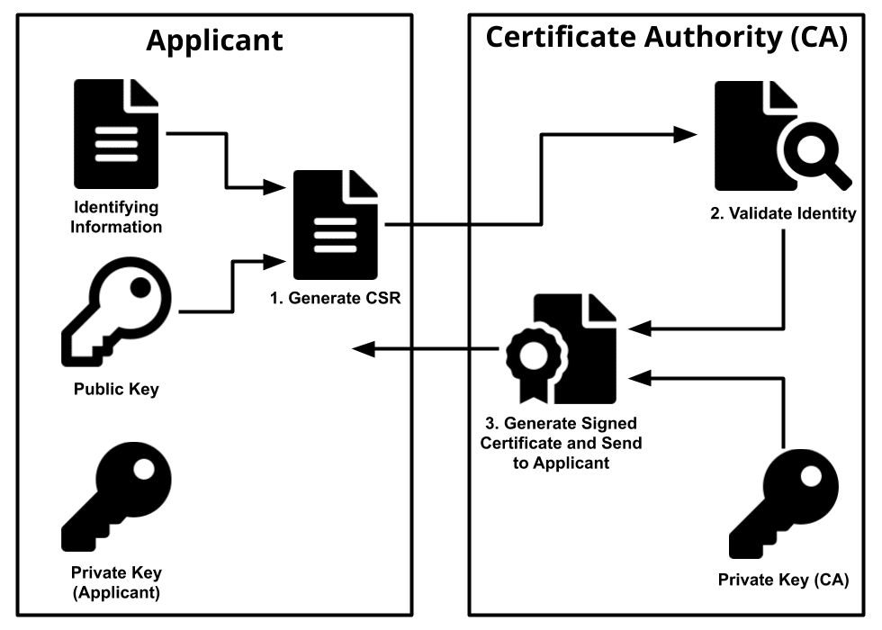

# HTTPS Terminologies

## Types of encryption
- Symmetric
- Asymmetric


## The life cycle of SSL certificates
### Step 1 : Generate public private key
- Let’s say Tom has a website and he wants to implement SSL to secure his website. In order to do so, he will first first generate 2 keys.
  - Private key
  ```
  openssl genrsa -out private.pem 2048
  ```
  - Public key
  ```
  openssl rsa -in private.pem -outform PEM -pubout -out public.pem
  ```

### Step 2. Generate a CSR
- To get the get Tom’s certificate certified, we need to ask an authority( There are so many available like Godaddy, Verisign, Norton etc) by creating a CSR request(Certificate Signing Request). The CSR file needs to be generated by the user, so here Tom uses his private key to generate a CSR.
- This is how the CSR can be generated.
```
openssl req -new -key private.pem -out certificate.csr
```

- Here there will be number of question we need to answer
- After all these questions answered, we will get a .csr file(Here certificate.csr).
- The certificate.csr file is not the certificate which Tom can use in his website. It is the digital form( A standard way) of submitting a certificate signing request.
- This CSR file needs to be sent to a Certificate Authority of choice, who after verifying a lot of stuff will provide with a certificate, which can be used by Tom in his website.

### Step 3: Apply for a CSR(Certificate Signing Request)
- After getting the CSR from Tom the certificate authority makes a number of tasks. Here is a link to view the roles of a certificate authority. Here are some major ones:
  1. Receive, authenticate, process certificate revocation requests.
  1. Identify, authenticate subscribers, here Tom’s certificate and its authenticity.
  1. Obtain public key from subscriber, here the public key from Tom’s certificate.
  1. Verify subscriber has the asymmetric private key corresponding to the public key.

- After all verification is done the Certificate Authority will finally provide the certificate(Typically in .crt format) which Tom can use for this website
- The Certificate Authority charges Tom for the service they did and also gives a date till when the certificate is valid. After that Tom again needs to get a new certificate.

### A few concepts
#### So what is a certificate?
- A certificate is nothing but a simple document containing the public key and some information about the organization who is creating the certificate.

- We can see the certificate in raw for using the openssl library. Assuming the openssl library is installed in the host machine, run this:
```
openssl s_client -showcerts -connect medium.com:443
```

#### What is a signature?
- A signature of a certificate is a piece of data inside the certificate which is the only thing that is used to validate the integrity and validity of the certificate.
- The verifier needs to decrypt the signature by the provided public key in the certificate to get the checksum. Then the verifier will calculate the checksum of the cert itself. These 2 checksum must match to ascertain the integrity and validity of the user sending the certificate.

### Step 4: The certificate authority signs the certificate
- Now here is the question, what does it mean to sign a certificate?
  - Signing simply means that the certificate authority has verified the certificate, (here Tom’s certificate) and it can now vouch for Tom’s certificate’s authenticity. After signing the CA provides a certificate to the user, here Tom.

- In order to sign, the certificate authority
    - Calculates the checksum of Tom’s certificate using some algorithm.
    - Encrypts the checksum using it’s (The certificate authority’s) private key
    - Adds the encrypted checksum in Tom’s certificate as a signature.
    - Adds it’s own information/metadata(The certificate authority’s) in the certificate
    - After this process the certificate is created and the Certificate Authority hands the certificate to Tom

- The Certificate Authority(CloudFlare Inc ECC CA-3) also has it’s private key which key keep secret and uses the same to create the signature for Tom’s certificate.

### Some more concepts…
#### Root Certificate and Intermediate Certificate
- There is another Certificate Authority on top of CloudFlare(Who certifies medium.com). This is the Root Certificate Authority. Here in this case the Root Certificate authority is Baltimore Cybertrust Root(Root CAs generally have Root at the end of their name to make them obvious)
- Root certificate also works exactly the same way. Just like CloudFlare Certificate Authority signed medium.com’s certificate using it’s private key, the Root Certificate Authority(Here Baltimore Cybertrust Root) uses it’s private key to sign CloudFlare’s certificate

- Note, here the issuer and the certifier is the same, so the Root Certificate Authority does not need any other entity to certify themselves. The self sign their certificate(Uses own private key to sign) to make the signature


### Some Images to understand the concepts better





## Reference:
  - https://www.youtube.com/watch?v=qXLD2UHq2vk
  - https://www.youtube.com/watch?v=r1nJT63BFQ0
  - https://www.youtube.com/watch?v=33VYnE7Bzpk
  - https://www.youtube.com/watch?v=sEkw8ZcxtFk
  - https://www.youtube.com/watch?v=zrkH_pmEu6w
  - https://medium.com/geekculture/story-of-ssl-certificates-161f29df8b65
